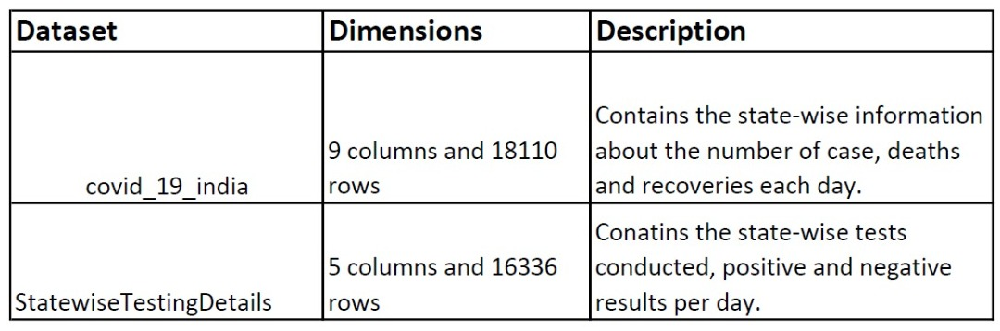
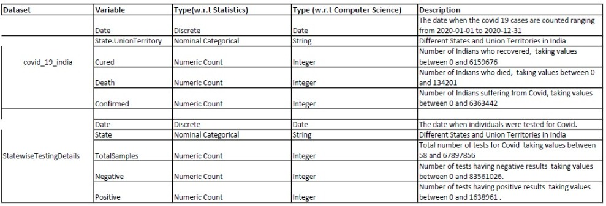

```{r setup, include=FALSE}
knitr::opts_chunk$set(echo = TRUE)
```


```{r}
setwd('D:/Sucheta/CMI/Visualization') #changed the working directory
```

----
#INTRODUCTION
----
----
The coronavirus disease (COVID-19) pandemic, which originated in the city of Wuhan,
China, has quickly spread to various countries, with many cases having been reported worldwide.
The first cases of COVID-19 in India were reported on 30 January 2020 in three towns of Kerala, 
among three Indian medical students who had returned from Wuhan, the epicenter of the pandemic.
The number of Coronairus cases have been increasing rapidly in India since then. The aim of
the project is to analyse the trends in Covid-19 cases in India from January,2020 to January,2021.
The project has two datasets, covid_19_india.csv and StatewiseTestingDetails.csv.
----                 
                 

```{r pressure, echo=FALSE, fig.cap="A caption", out.width = '100%'}



```


```{r,fig=T}
library(tidyverse)

#Downloaded the dataset covid_19_india.csv from kaggle.com
covid_data = data.frame(read.csv('D:\\Sucheta\\CMI\\Visualization\\covid_19_india.csv',stringsAsFactors = F))

#We shall clean the dataset covid_data
print(paste("The number of rows in the data: ",nrow(covid_data)))
print(paste("The number of columns in the data: ",ncol(covid_data)))

head(covid_data)
#We can see that there are certain columns which are not needed for our analysis. We shall remove those columns.
covid_data = subset(covid_data,select=-c(Sno,ConfirmedIndianNational,ConfirmedForeignNational,Time))

#We shall check for NA entries in the data.
sum(is.na((covid_data)))
#Since there are no entries we can continue

#Convert the string type 'Date; variable to Date type variable.
covid_data$Date = as.Date(covid_data$Date,format = c("%d-%m-%y"))


#After some cleaning of the data
print(paste("The number of rows in the data: ",nrow(covid_data)))
print(paste("The number of columns in the data: ",ncol(covid_data)))

#Structure of the data
str(covid_data)

#Summary of the data
summary(covid_data)

#Top 6 rows of the data
head(covid_data)

```


```{r,fig=T}

#Let us first look at the variables in covid_data.

print(paste("The first case of Covid 19 reported in ",covid_data[1,2],'on',covid_data[1,1]))

print(paste("The total number of Covid Cases in India are: ",sum(covid_data$Confirmed)))
print(paste("The total number of Deaths due to Covid in India are: ",sum(covid_data$Deaths)))
print(paste("The total number of People who recovered from Covid in India are: ",sum(covid_data$Cured)))

#State with the highest number of Covid-19 cases in one day
highest = covid_data$State.UnionTerritory[covid_data$Confirmed == max(covid_data$Confirmed)]
print(paste('The state with the maximum number of covid cases is :', unique(highest)))

#States with the lowest number of Covid-19 cases in one day
lowest = covid_data$State.UnionTerritory[covid_data$Confirmed == min(covid_data$Confirmed)]
print((paste('The state with the minimum number of covid cases are :', unique(lowest)[1], 'and', unique(lowest)[2])))

```

```{r,fig=T}

#Univariate Graphical Analysis of each Variable in covid_data


#Let us look at each column

#Variable: State.UnionTerritory
summary(covid_data$State.UnionTerritory)
print(unique(covid_data$State.UnionTerritory))

#We can see there are some repetitions of states with the same name. We shall fix this by renaming them.

covid_data['State.UnionTerritory'][covid_data['State.UnionTerritory']=='Maharashtra***']='Maharashtra'
covid_data['State.UnionTerritory'][covid_data['State.UnionTerritory']=='Madhya Pradesh***']='Madhya Pradesh'
covid_data['State.UnionTerritory'][covid_data['State.UnionTerritory']=='Bihar****']='Bihar'
covid_data['State.UnionTerritory'][covid_data['State.UnionTerritory']=='Daman & Diu']='Dadra and Nagar Haveli and Daman and Diu'
covid_data['State.UnionTerritory'][covid_data['State.UnionTerritory']=='Dadra and Nagar Haveli']='Dadra and Nagar Haveli and Daman and Diu'
covid_data['State.UnionTerritory'][covid_data['State.UnionTerritory']=='Himanchal Pradesh']='Himachal Pradesh'
covid_data['State.UnionTerritory'][covid_data['State.UnionTerritory']=='Karanataka']='Karnataka'
covid_data['State.UnionTerritory'][covid_data['State.UnionTerritory']=='Telengana']='Telangana'

#Some values in the column State.UnionTerritory are not w.r.t a state. We can remove the data corresponding to them.
covid_data = covid_data[covid_data['State.UnionTerritory']!='Cases being reassigned to states',]
covid_data = covid_data[covid_data['State.UnionTerritory']!='Unassigned',]

print(sort(unique(covid_data$State.UnionTerritory)))
#Now our Data has 36 different values for State.UnionTerritory, 28 States and 8 Union Territories

#Let us group the data state-wise
covid_state = covid_data%>%group_by(State.UnionTerritory)
#Find the total number of covid cases, deaths and recoveries in each state
covid_state_sum = covid_state%>%summarise(Cured = sum(Cured),Deaths = sum(Deaths), Confirmed = sum(Confirmed))
print(head(covid_state_sum))
#covid_state_sum contains the Total number of cases, recoveries and deaths for each State and Union Territory

#Function to create the bar plot for a state with values of Total number of cases, recoveries and deaths.
state_values = function(state){
  state_data = covid_state_sum[covid_state_sum$State.UnionTerritory==state,]
  value= c(state_data$Confirmed, state_data$Cured, state_data$Deaths)
  barplot(value,col=i,main=paste('Bar Plot for ',state),names.arg=c('Confirmed','Cured','Deaths'))
}

#plots barplot of the 36 states and Union Territories
par(mfrow=c(3,4))
for (i in 1:36){
  state_values(covid_state_sum$State.UnionTerritory[i])
}
par(mfrow=c(1,1))
```

```{r,fig=T}
#Variable: Date
summary(covid_data$Date)
str(covid_data$Date)
#The dataset has details of Covid 19 in India for the year 2020

#Group the dataset by date
covid_date = covid_data%>%group_by(Date)
head(covid_date)
#Find the number of deaths, recoveries and cases per day
covid_date_sum = covid_date%>%summarise(Cured = sum(Cured),Deaths = sum(Deaths), Confirmed = sum(Confirmed))
head(covid_date_sum)

jan_date = seq.Date(from =as.Date("01-01-2020", "%d-%m-%y"), 
                to=as.Date("31-01-2020", "%d-%m-%Y"), by="day")
#Look at the dataset for January,2020
covid_Jan_2020= covid_date_sum[covid_date_sum$Date %in% jan_date,]
#Plot the number of deaths, recoveries and cases per day in January,2020
ggplot(covid_Jan_2020,aes(Date))+geom_line(aes(y=Confirmed,colour='Confirmed'))+
  geom_line(aes(y=Cured,colour='Cured'))+geom_line(aes(y=Deaths,colour='Deaths'))+
  ylab('Number')+ggtitle('Cases, Deaths and Recoveries in January,2020')


#In January, the number of confirmed cases and cured cases were always high, 
#though the number of deaths was very low. The three remained relatively the
#same throughout the month, since their curves are flat.


```

```{r,fig=T}
#Variable: Confirmed
summary(covid_data$Confirmed)
str(covid_data$Confirmed)
hist(covid_data$Confirmed, col='skyblue',main='Histogram for Covid Cases',xlab='Number of cases')
boxplot(covid_data$Confirmed)
plot(density(covid_data$Confirmed),main='Density of Comfirmed cases')
ggplot(covid_data,aes(x=Date))+ geom_line(aes(y=Confirmed, col="Confirmed")) #Number of Covid cases with time

#Variable: Cured
summary(covid_data$Cured)
str(covid_data$Cured)
hist(covid_data$Cured, col='yellow',main='Histogram for Recovered Cases',xlab='Number of Recovered Cases')
boxplot(covid_data$Cured)
plot(density(covid_data$Cured),main='Density of Cured cases')
ggplot(covid_data,aes(x=Date))+ geom_line(aes(y=Cured, col='Cured') ) #number of recoveries with time

#Variable: Deaths
summary(covid_data$Deaths)
str(covid_data$Deaths)
hist(covid_data$Deaths, col='yellow',main='Histogram for Deaths',xlab='Number of Deaths')
boxplot(covid_data$Deaths)
plot(density(covid_data$Deaths),main='Density of Deaths')
plot(x=covid_data$Date, y=covid_data$Deaths,main='Covid Deaths with time',xlab='Month',ylab='Number of deaths',type='l')
ggplot(covid_data,aes(x=Date,col='Blue'))+ 
  geom_line(aes(y=Deaths, col="Deaths"))+ ylim(c(0,600000)) #number of deaths with time

```


```{r,fig=T}
#Download the second dataset StatewiseTestingDetails.csv from kaggle.com
testing_data = data.frame(read.csv('D:\\Sucheta\\CMI\\Visualization\\StatewiseTestingDetails.csv',stringsAsFactors = F))

#let us now look at the dataset testing_data
head(testing_data)

summary(testing_data)
#Some of the values in the data is NA so we shall remove these
testing_data[is.na(testing_data)]=0

#Convert the string type 'Date; variable to Date type variable.
testing_data$Date = as.Date(testing_data$Date,format = c("%Y-%m-%d"))

#Structure of the data
str(testing_data)

#Summary of the data
summary(testing_data)

#Top 6 rows of the data
head(testing_data)
```


```{r,fig=T}

#Let us look at the testing_data

print(paste("The first test of Covid 19 was conducted in ",testing_data[1,2],'on',testing_data[1,1]))

print(paste("The total number of Covid Tests conducted in India are: ",sum(testing_data$TotalSamples)))
print(paste("The total number of Tests with negative result in India are: ",sum(testing_data$Negative)))
print(paste("The total number of Tests with positive result in India are: ",sum(testing_data$Positive)))

#State with the highest number of positive tests
high_pos = testing_data$State[testing_data$Positive == max(testing_data$Positive)]
print(paste('The state with the maximum number of Positive Tests is :', unique(high_pos)))

#State that conducted the maximum number of tests
high_test = testing_data$State[testing_data$TotalSamples == max(testing_data$TotalSamples)]
print(paste('The state conducting the maximum number of Tests is :', unique(high_test)))
```

```{r,fig=T}
#Univariate Graphical Analysis on the variables in testing_data

#Looking at the total number of tests, positive results and negative results
tot_sam = sum(testing_data$TotalSamples)
tot_pos = sum(testing_data$Positive)
tot_neg =sum(testing_data$Negative)
total=c(tot_sam,tot_pos,tot_neg)
type_sam=c('Samples','Positive','Negative')
df = data.frame(type_sam,total)
ggplot(df,aes(x=type_sam,y=total))+geom_bar(stat='identity')+xlab("")

#Variable: Date
summary(testing_data$Date)
str(testing_data$Date)
print(paste('The tests have been conducted from',testing_data$Date[1],'to',testing_data$Date[length(testing_data$Date)]))
ggplot(testing_data,aes(x=Date))+geom_point(aes(y=TotalSamples,colour='TotalSamples'))+
  geom_point(aes(y=Negative,colour='Negative'))+geom_point(aes(y=Positive,colour='Positive'))

#Variable: State
print(unique(testing_data$State))
#We get 28 States and 8 Union Territories

#variable: TotalSamples
summary(testing_data$TotalSamples)
str(testing_data$TotalSamples)
hist(testing_data$TotalSamples, col='skyblue',main='Histogram for Covid tests',xlab='Number of tests')
boxplot(testing_data$TotalSamples)
plot(density(testing_data$TotalSamples),main='Density of samples')
ggplot(testing_data,aes(x=Date))+ geom_line(aes(y=TotalSamples, col="TotalSamples"))+
  ggtitle("Number of samples")+ylab('Number')

#As compared to the number of samples, positive tests were very few. But we can 
#understand there is an incosistency in the data since, the number of samples
#is not equal to the total number of positive and negative results.

#variable: Positive
summary(testing_data$Positive)
str(testing_data$Positive)
hist(testing_data$Positive, col='skyblue',main='Histogram for Positive Tests',xlab='Number of Positive Tests')
boxplot(testing_data$Positive)
plot(density(testing_data$Positive),main='Density of Positive samples')
ggplot(testing_data,aes(x=Date))+ geom_line(aes(y=Positive, col="Positive"))+
  ggtitle("Number of Positive samples")+ylab('Number')

#variable: Negative
summary(testing_data$Negative)
str(testing_data$Negative)
hist(testing_data$Negative, col='skyblue',main='Histogram for Negative Tests',xlab='Number of Negative Tests')
boxplot(testing_data$Negative)
plot(density(testing_data$Negative),main='Density of Negative samples')
ggplot(testing_data,aes(x=Date))+ geom_line(aes(y=Negative, col="Negative"))+
  ggtitle("Number of Negative samples")+ylab('Number')

```

```{r,fig=T}

#Multivariate Graphical Analysis

#Comparison between number of confirmed cases, deaths and cured cases.

n =nrow(covid_data) #number of rows in covid_data
x=1:n
sam = sample(x,5000,replace=FALSE)  #1000 random integers 
sample_data = covid_data[sam,]
#look at the plot for 1000 different days
plot(sample_data[,3:5],pch=20) #scatterplot for number of cases, deaths and recoveries

#We can see the number of cured cases and the number of confirmed cases are linearly related.
#There is a positive relation of the number of deaths with the other two variables but this is
#not a linear relation.

#plot the cured cases against the number of cases
qplot(Confirmed,Cured,data=covid_data,geom='smooth')
#This plot confirms the linear relationship between the number of recoveries and confirmed cases.

#plot the deaths against the number of cases
qplot(Confirmed,Deaths,data=covid_data,geom='smooth',ylim=c(0,max(covid_data$Confirmed)/10))
#As compared to the number of cases, deaths are very few but they have a positive slope.

ggplot(sample_data,aes(x=Date))+ geom_point(aes(y=Confirmed, col="Confirmed"), group=1, size = 1) + 
  geom_point(aes(y=Cured, col="Cured"), group=1, size = 1) + 
  geom_point(aes(y=Deaths, col="Deaths"), group=1, size = 1)+ylab("Number of Cases")

#the blue points(for Death cases) are towards the bases indicating their lower values. Whereas the
#red and green points are more or less scattered and are very close to each other for each day. 
#There was a steep increase in the count during the months June to September.
```


```{r,fig=T}

#Comparison between number of cases,deaths and recoveries state-wise.

#Summary of confirmed Covid19 cases state-wise
by(covid_state_sum$Confirmed,covid_state_sum$State.UnionTerritory,summary)
#Summary of cured cases state-wise
by(covid_state_sum$Cured,covid_state_sum$State.UnionTerritory,summary)
#Summary of deaths state-wise
by(covid_state_sum$Deaths,covid_state_sum$State.UnionTerritory,summary)

#horizontal bar plot showing the number of cases for each state
ggplot(covid_state_sum, aes(x=State.UnionTerritory, y=Confirmed))+
  geom_col(fill="lightblue")+coord_flip()+xlab("State/Union Territory")

#horizontal bar plot showing the number of recoveries for each state
ggplot(covid_state_sum, aes(x=State.UnionTerritory, y=Cured))+
  geom_col(fill="lightpink")+coord_flip()+xlab("State/Union Territory")

#horizontal bar plot showing the number of deaths for each state
ggplot(covid_state_sum, aes(x=State.UnionTerritory, y=Deaths))+
  geom_col(fill="lightgreen")+coord_flip()+xlab("State/Union Territory")


#Comparison between number of tests,positive and negative results state-wise.
#Let us group the data state-wise
testing_state = testing_data%>%group_by(State,Date)%>%summarise(Positive=sum(Positive), TotalSamples=sum(TotalSamples),Negative=sum(Negative))

head(testing_state)

#horizontal bar plot showing the number of tests for each state
ggplot(testing_state, aes(x=State, y=Positive))+
  geom_col(fill="lightblue")+coord_flip()+xlab("State/Union Territory")

#horizontal bar plot showing the number of recoveries for each state
ggplot(testing_state, aes(x=State, y=TotalSamples))+
  geom_col(fill="lightpink")+coord_flip()+xlab("State/Union Territory")

#horizontal bar plot showing the number of deaths for each state
ggplot(testing_state, aes(x=State, y=Negative))+
  geom_col(fill="lightgreen")+coord_flip()+xlab("State/Union Territory")


#look at the states having number of cases above the average.
greater = covid_state_sum[covid_state_sum['Confirmed']>=mean(covid_state_sum$Confirmed),]
print(paste("The number of regions having number of cases above the average",nrow(greater)))
ggplot(greater,aes(x=State.UnionTerritory,y=Confirmed))+geom_bar(stat='identity')+
  coord_flip()+xlab("State/UnionTerritory")

#From the plot it is clear Maharasthra has the maximum number of cases and the other states have
#less than 50% of the cases Maharashtra had.

#look at the states having number of positive results above the average.
greater_test = testing_state[testing_state['Positive']>=mean(testing_state$Positive),]
print(paste("The number of regions having number of positive results above the average",nrow(greater_test)))
ggplot(greater_test,aes(x=State,y=Positive))+geom_bar(stat='identity')+
  coord_flip()+xlab("State/UnionTerritory")

par(mfrow=c(1,3))

#Plots the number of cases for the State with the maximum number of Covid cases
plot(y= covid_data$Confirmed[covid_data$State.UnionTerritory==highest], 
     covid_data$Date[covid_data$State.UnionTerritory==highest],xlab ='Month', ylab="Number of cases",
     main = paste("Covid Cases in:",highest),col='red')
#there's a sharp increase in the number of cases

#Plots the cases for the States with the minimum number of Covid cases
plot(y= covid_data$Confirmed[covid_data$State.UnionTerritory==(unique(lowest))[1]], 
     covid_data$Date[covid_data$State.UnionTerritory==(unique(lowest))[1]],xlab ='Month', ylab="Number of cases",
     main = paste("Covid Cases in:",(unique(lowest))[1]),col='blue',ylim = c(0,636344))

plot(y= covid_data$Confirmed[covid_data$State.UnionTerritory==(unique(lowest))[2]], 
     covid_data$Date[covid_data$State.UnionTerritory==(unique(lowest))[2]],xlab ='Month', ylab="Number of cases",
     main = paste("Covid Cases in:",(unique(lowest))[2]),col='green', ylim = c(0,636344))

#For both the states we can see the number of cases is relatively flatter.
#There's a break during the months September to November indicating no cases
#during this time period.

#We shall look at the top 6 states with the highest number of Covid cases
top = sort(covid_state_sum$Confirmed)[31:36]
highest_cases = covid_state_sum[covid_state_sum$Confirmed %in% top,]
#Pie Chart displaying the number of Covid Cases in each state
pie(as.vector(highest_cases$Confirmed)/100,label=highest_cases$State.UnionTerritory,cex=0.5,
    main='Covid Cases in top 6 States')

#We shall look at the top 6 states with the highest number of deaths
top = sort(covid_state_sum$Deaths)[31:36]
highest_deaths = covid_state_sum[covid_state_sum$Deaths %in% top,]
#Pie Chart displaying the number of deaths in each state
pie(as.vector(highest_deaths$Deaths),label=highest_deaths$State.UnionTerritory,cex=0.5,
    main='Deaths in top 6 States')

#We shall look at the top 6 states with the highest number of recoveries
top = sort(covid_state_sum$Cured)[31:36]
highest_cured = covid_state_sum[covid_state_sum$Cured %in% top,]
#Pie Chart displaying the number of recoveries in each state
pie(as.vector(highest_cured$Deaths),label=highest_cured$State.UnionTerritory,cex=0.5,
    main='Recoveries in top 6 States')

library(dplyr)

#Plot the number of cases for different states with time
covid_date_state= covid_data%>%group_by(Date, State.UnionTerritory)
head(covid_date_state)
covid_ds_sum = covid_date_state%>%summarise(Cured = sum(Cured),Deaths = sum(Deaths), Confirmed = sum(Confirmed))
head(covid_ds_sum)
ggplot(covid_ds_sum,aes(x=Date,y=Confirmed))+geom_point()+facet_wrap(State.UnionTerritory~.)
#Plots for most of the state are flat except Maharashtra, Tamil Nadu, Karnataka,
#Kerala, Andhra Pradesh, Uttar Pradesh and West Bengal

#Dataset with the first 6 states having the maximum number of cases on the last available date. 
last_covid_data=filter(covid_data,Date==max(Date))%>%top_n(6,Confirmed)

#Plot the number of cases,deaths and recoveries in the top 6 states on the last available date.
ggplot(last_covid_data,aes(x=State.UnionTerritory))+geom_col(aes(y=Confirmed, fill='Confirmed'))+
  geom_col(aes(y=Cured, fill='Cured'))+geom_col(aes(y=Deaths, fill='Deaths'))+xlab("State/Union Territory")+
  ylab("Number")+ggtitle(paste("Number of cases on ",max(covid_data$Date)))
#The top 6 states have almost the same number of covid cases and recoveries, though Maharashtra 
#and Kerala show a relatively higher difference between the two, the number of deaths 
#for Maharashtra is also the highest among the 6.
```


```{r,fig=T}

#We shall merge the two dataframes, to do this we need to rename the column 
#State.UnionTerritory in covid_data so that we can merge the two dataframes 
#w.r.t date and State which are the two common columns.

names(covid_data)[names(covid_data)=='State.UnionTerritory']='State'
merged_data = merge(covid_data,testing_data)
head(merged_data)
str(merged_data)
summary(merged_data)
dim(merged_data)

#our new dataset has 8 variables: Date(Date), State(String), Confirmed(Int), Cured(Int), Deaths(Int), 
#TotalSamples(Int), Positive(Int) and Negative(Int).

max_date = covid_data$Date[covid_data$Confirmed==max(covid_data$Confirmed)]
print(paste("The maximum number of cases were observed on: ",max_date))

#Top 6 States having maximum number of recoveries on max_date
top_cured= merged_data %>% filter(Date == max_date )%>%arrange(desc(Cured))%>%top_n(6)
print(top_cured)

#Number of recoveries on the last day
ggplot(top_cured, aes(x=State,y=Cured)) + geom_col(aes(color=State,fill=State))

#the other states have values less than 25% of the number of cured cases for Maharashtra.

top_cases= merged_data %>% filter(Date == max_date )%>%arrange(desc(Confirmed))%>%top_n(15)

top_merged = filter(merged_data,State %in% top_cases$State)
head(top_merged)
ggplot(top_merged,aes(x=TotalSamples,y=Confirmed)) + geom_smooth(aes(colour=State),se=FALSE)
#The plot compares the total number of tests conducted and the number confirmed cases in the
#top 8 states with the maximum number of covid cases.
#We can see for each state as the number of tests increase the number of cases decreases,
#but after a certain level the behaviour changes. Maharashtra and Kerala show the most 
#fluctuating pattern.

boxplot(top_merged$Confirmed~top_merged$State,notch=TRUE, xlab='State/Union Territory',
        ylab='Confirmed cases',cex.axis=0.7)
#The median of the data lies at a very low value and the data is skewed.
#Telangana has outliers as well.

boxplot(top_merged$Cured~top_merged$State,notch=TRUE, xlab='State/Union Territory',
        ylab='Cured cases',cex.axis=0.7)
#The median of the data lies at a very low value and the data is skewed.
#Their are several outliers for the states Kerala and Telangana.

#Group the merged_data by Date
merged_date = merged_data%>%group_by(Date)
head(merged_date)
merged_date_sum = merged_date%>%summarise(Cured = sum(Cured),Deaths = sum(Deaths), 
                                          Confirmed = sum(Confirmed),Positive=sum(Positive), 
                                          TotalSamples=sum(TotalSamples),Negative=sum(Negative))
head(merged_date_sum)
#We get the cumulative value of each numeric variable day-wise.
ggplot(merged_date_sum,aes(x=Date)) + geom_line(aes(y=Confirmed),color='red',size=1) +
  ggtitle("Confirmed Cases with time")+ xlab("Month") + ylab("Number of Cases")+
  geom_line(aes(y=Cured),color='blue',size=1)+geom_line(aes(y=Deaths),color='green',size=1)
#Plots the Number of Covid19 cases,deaths and recoveries over time

#group the data w.r.t date as well as state
merged_ds_sum = merged_data%>%group_by(Date,State)%>%
  summarise(Cured = sum(Cured),Deaths = sum(Deaths), Confirmed = sum(Confirmed),
            Positive=sum(Positive), TotalSamples=sum(TotalSamples),Negative=sum(Negative))

head(merged_ds_sum)
#Plot the number of positive case for each state with time.
ggplot(merged_ds_sum)+geom_point(aes(x=Date,y=Positive,colour=State))

#Plot the number of Deaths against the number of Positive cases
qplot(Positive,Deaths,data = merged_data,geom='smooth')
#We can see the number of deaths sharply increase as more people are tested positive
#but then after reaching a peak it starts declining but very slowly.

plot(merged_ds_sum[,3:8])
#Scatterplot for the variables in the merged dataset.
```

```{r,fig=T}

#Monthly Data
library(lubridate)

merged_month = aggregate(cbind(Cured,Deaths,Confirmed,
                               TotalSamples,Negative, Positive)~ month(merged_data$Date), data=merged_data,FUN=sum)
head(merged_month)
names(merged_month)[names(merged_month)=='month(merged_data$Date)']='Month'
merged_month

library(reshape2)
d = melt(merged_month, id.vars="Month",variable.name ='Type')
head(d)
library(ggplot2)

ggplot(d, aes(Month, value)) +
  geom_line(aes(colour = Type),size=1)+ylab("Count")

#Let us now look at the monthly data of each state. We shall create a new column
#corresponding to month.
covid_state[['Month']]=month(covid_state$Date)

covid_state_month = covid_state%>%group_by(State.UnionTerritory,Month)%>%
  summarise(Cured = sum(Cured),Deaths = sum(Deaths), Confirmed = sum(Confirmed))
head(covid_state_month)


testing_state[['Month']]=month(testing_state$Date)
testing_state_month = testing_state%>%group_by(State,Month)%>%summarise(Positive=sum(Positive), TotalSamples=sum(TotalSamples),Negative=sum(Negative))
head(testing_state_month)

#Merge the two monthly datasets
names(covid_state_month)[names(covid_state_month)=='State.UnionTerritory']='State'
merged_state_month = merge(covid_state_month,testing_state_month)

head(merged_state_month)

#Plot the count of each variable for each state on a monthly basis.
d1 = melt(merged_state_month, id.vars=c("State","Month"),variable.name ='Type')
ggplot(d1, aes(Month, value)) +
  geom_col(aes(fill = Type),size=1)+ylab("Count")+facet_wrap(State~.)+xlim(4,12)

#look at the merged data for the states with the highest number of cases.
df = filter(merged_state_month,State %in% top_cases$State)
d2 = melt(df, id.vars=c("State","Month"),variable.name ='Type')

#Monthly bar plot for the top states.
ggplot(d2, aes(State, value)) +
  geom_col(aes(fill = Type),size=1)+ylab("Count")+facet_wrap(Month~.)+
  coord_flip()


```
---
CONCLUSION

The first Covid 19 case was observed in January in Kerala. These numbers kept on
increasing and were maximum during the months May to July. Initially no tests were
being conducted, but later on the number of tests conducted increased sharply 
during the end of the year. Though there was a decrease in the number of Covid 
cases and Deaths towards the end. Most of the people suffering from Covid 
recovered as seen by the linear correlation between the two variables.
The number of Deaths initially increased sharply but later on started decreasing.

From the above plots we can conclude that Maharashtra observes the highest number
of Covid 19 Cases,deaths and recoveries followed by Karnataka in the year 2020.
Rest of the states though had high values but had numbers even less than 
Maharashtra. Maharashtra was also among one of those states which had the maximum 
number of positive results for the tests followed by Kerala.

We can conclude that with time as the number of tests increased the total number
Covid 19 cases kept decreasing. Also in Maharasthra there was a sharp fall in the
number of cases, though this didn't last long and further increased. All the 
States and Union Territories of India were badly affected during the middle of 
the year. States in the southern part of India were among the top States with 
maximum number of Covid19 cases. The north-eastern part of India was fairly protected
by the virus as can be seen with its low numbers.
---